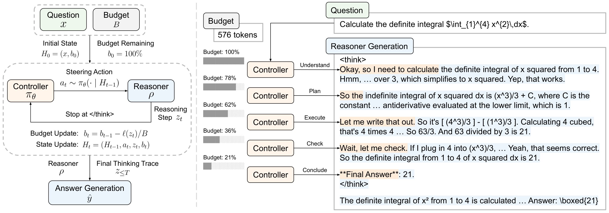

<div align="center">

## ACTS: Agentic Chain-of-Thought Steering

A lightweight **controller agent** steers a **frozen reasoner** step by step under a thinking-token budget — choosing a reasoning *strategy* and a short *steering phrase* at each step — for controllable accuracy–efficiency trade-offs without retraining the reasoner.

<p align="center">
  <a href="TODO"></a>
  <a href="https://huggingface.co/yuuxia/acts-controller"></a>
  <a href="https://huggingface.co/datasets/yuuxia/controller-sft-data"></a>
</p>

</div>

<p align="center">
  
</p>
<p align="center"><em>Left: a controller agent steers a frozen reasoner step by step under a thinking-token budget. Right: an illustrative controller-steered generation.</em></p>

## 🌟 Overview

Long chain-of-thought reasoning improves accuracy but spends tokens inefficiently, and existing efficient-reasoning methods only control *how long* a model thinks — leaving *how* it thinks implicit. ACTS instead steers the stepwise reasoning behavior itself, formulating reasoning steering as a Markov decision process where a controller guides a frozen reasoner under a budget.

**1. Strategy-level steering, not length control.** At each step the controller observes the reasoning trace and remaining budget, then emits a high-level reasoning strategy (e.g., *plan*, *execute*, *check*, *conclude*) and a short natural-language phrase that initiates the reasoner's next step. This gives reasoner-agnostic, in-flight control while preserving the reasoner's native generation style — one controller transfers across reasoners and tasks without retraining them.

**2. Two-stage training with budget-conditioned reward.** The controller is first initialized from synthetic steering trajectories (segmented from expert traces, annotated with the implied strategy and step-opening phrase) with multi-budget augmentation, then refined with reinforcement learning under a budget-conditioned reward that penalizes both overthinking and premature termination.

We release the constructed **SFT steering trajectories** ([`controller-sft-data`](https://huggingface.co/datasets/yuuxia/controller-sft-data)), and a **ACTS controller agent checkpoint** ([`acts-controller`](https://huggingface.co/yuuxia/acts-controller)).

## 📦 Setup

ACTS uses two conda envs, kept binary-compatible (Python 3.12 · CUDA 12.8 · torch 2.9.1 · flash-attn 2.8.3):

```bash
./scripts/env_setup_slime.sh      # RL training + evaluation (SGLang / Megatron / SLIME)
./scripts/env_setup_openrlhf.sh   # controller SFT (DeepSpeed / OpenRLHF)
```

## ⚡ Quick inference demo

Run the released controller checkpoint to see ACTS in action:

```bash
conda activate slime
./scripts/run_acts_inference.sh \
    --controller yuuxia/acts-controller \
    --reasoner   deepseek-ai/DeepSeek-R1-Distill-Qwen-7B \
    --benchmark  aime2024 \
    --budget     10000
```

## 📥 Data

```bash
./scripts/get_data.sh all         # download the released SFT + RL data → data/
```

## 🚀 Training

```bash
# 1) Behavior initialization (SFT) → checkpoints/sft-controller
conda activate openrlhf && ./scripts/run_openrlhf_sft.sh

# 2) RL optimization with budget-conditioned reward shaping → checkpoints/rl-controller
conda activate slime && ./scripts/run_slime_rl.sh
```

## 🎓 Evaluation

Reproduce the full sweep — three reasoners × five benchmarks × a thinking-budget sweep:

```bash
conda activate slime
./scripts/run_vanilla_eval.sh     # full-thinking baseline
./scripts/run_acts_eval.sh        # ACTS sweep (controller from checkpoints/rl-controller)
```

Benchmarks are MATH-500, AMC, AIME 2024, OlympiadBench, and GPQA Diamond; `run_acts_eval.sh` runs the controller + reasoner as async SGLang servers. Edit the config block to change models, budgets, or GPU layout.

## 📝 Citation

```bibtex
@misc{xia2026acts,
      title={Agentic Chain-of-Thought Steering},
      author={TODO},
      year={2026},
      eprint={TODO},
      archivePrefix={arXiv},
      primaryClass={cs.CL},
}
```

## 🙏 Acknowledgments

Our implementation builds on [SLIME](https://github.com/THUDM/slime) for RL training and [OpenRLHF](https://github.com/OpenRLHF/OpenRLHF) for SFT training. We use [SGLang](https://github.com/sgl-project/sglang) for async controller/reasoner serving and `math_verify` for answer grading, and construct the SFT steering trajectories from [OpenR1-Math](https://huggingface.co/datasets/open-r1/OpenR1-Math-220k) traces.
